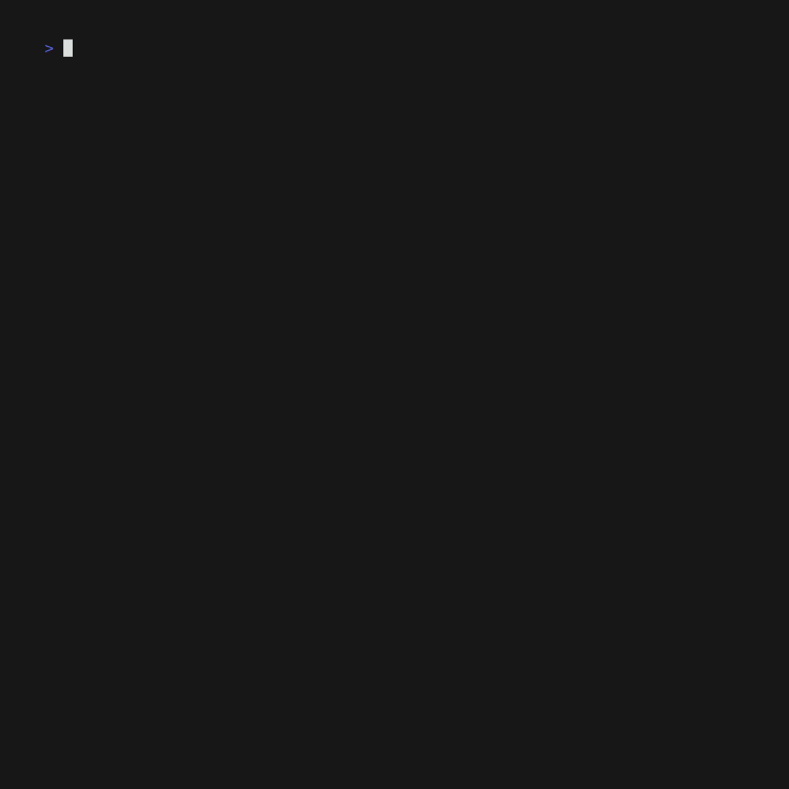

# Can I charge?

It's a question you might have asked yourself before if you have a BEV/PHEV.
This utility allows you to check if your favorite charging stations are available
for your car to charge, right from the warmth of your terminal! No need to go
outside and physically check if the charging station is available, and possibly
return disappointed because it was occupied.

## How to install

### Using pip

```bash
$ pip install can-i-charge
```

### AUR

A PKGBUILD has been created for this package, available on the [AUR](https://aur.archlinux.org/packages/python-can-i-charge).

```bash
paru -S python-can-i-charge
```

## How to use

An API key for the EnBW eMobility public API is required. Set it via the
`--api-key` flag or the `API_KEY` environment variable.

### CLI

The CLI can be used in the following ways:

```bash
# Using arguments
$ can-i-charge --api-key <API_KEY> --station <ID1> --station <ID2>
# Using env variables
$ export API_KEY="<API_KEY>"
$ export STATIONS="<ID1> <ID2>"
$ can-i-charge
# The script can also be called using its abbreviation
$ cic
```

You can pass as many stations as you want. At least one valid station is needed
to return data. Station IDs are numeric and can be found via the
[EnBW eMobility map](https://www.enbw.com/elektromobilitaet/produkte/laden/laden-unterwegs/ladestation-finden/).
You can use the developer tools to find the ID and APIKEY, which is also
needed.

### Prometheus Exporter

This utility can also be used as a Prometheus exporter:

```bash
# Using arguments
$ can-i-charge --api-key <API_KEY> --station <ID1> --station <ID2> --exporter --port <default is 9041> --interval <default is 60 seconds>
# Using env variables
$ export API_KEY="<API_KEY>"
$ export STATIONS="<ID1> <ID2>"
$ export EXPORTER=1
# Optionally also overwrite default interval and port
$ export EXPORTER_PORT=9000
$ export EXPORTER_INTERVAL=120
$ can-i-charge
```

## See it in action



## Container

### Build
```bash
$ docker build -t boosterl/can-i-charge:dev .
```

### Run
```bash
# Default
$ docker run --rm -e API_KEY='<API_KEY>' -e STATIONS='471003' boosterl/can-i-charge:dev

# Using exporter
$ docker run --rm -e API_KEY='<API_KEY>' -e STATIONS='471003' -e EXPORTER='1' -p 9041:9041 boosterl/can-i-charge:dev

# Using docker-compose
$ docker-compose up -d
```

### [dgoss](https://github.com/goss-org/goss/blob/master/extras/dgoss/README.md)
```bash
$ dgoss run boosterl/can-i-charge:dev
 INFO: Starting docker container
 INFO: Container ID: 97851a83
 INFO: Sleeping for 0.2
 INFO: Container health
 INFO: Running Tests
 User: can-i-charge: exists: matches expectation: true
 INFO: Deleting container
```

## Acknowledgments

This application uses the EnBW eMobility public API, and got inspired by the
excellent work of the [EnBW Home Assistant integration](https://github.com/mKenfenheuer/enbw_chargestations).
